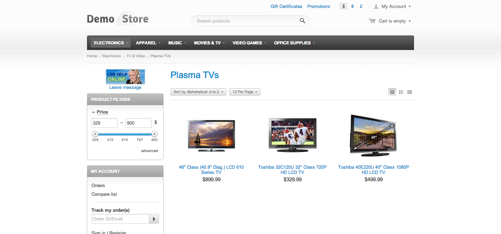
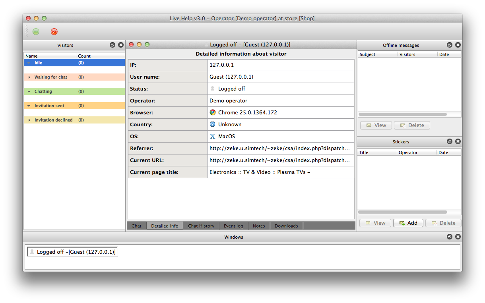
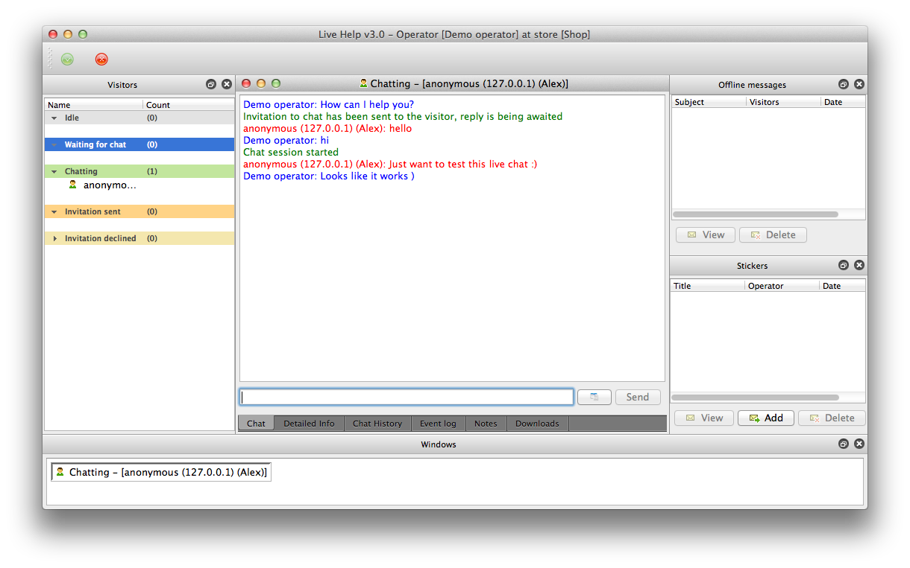

Live Help
=========

Live Help - online chat and stats for your site

Screenshots
===========

Current state
=============

Client part is written in C++ and Qt, and can be compiled on Windows, Linux, and Mac systems.
Server part is written as an add-on for CS-Cart (http://www.cs-cart.com) shopping cart software in PHP.

License
=======

This code has double license - MIT and LGPL 2.1
